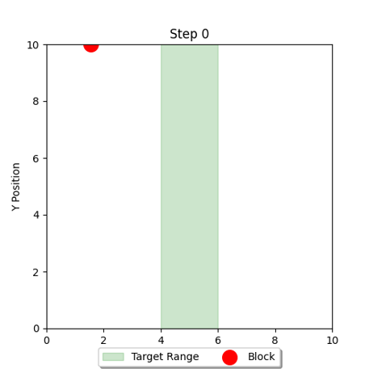

# Policy_Gradient
Reinforcement_Learning_Policy_Gradient_Algorithm

# 问题描述
假设有一个二维的环境，左边界𝑥_𝑙𝑒𝑓𝑡=0，右边界𝑥_right=10，高度ℎ=10。地面位置(ℎ=0)分为安全区域和危险区域，安全位置的左边界𝑙𝑒𝑓𝑡=4，右边界𝑟𝑖𝑔ℎ𝑡=6，其余均为危险区域。

有一个智能体方块，从指定高度(ℎ=10)的某个随机水平位置开始，每次下降一个单位，下降过程中智能体每次只有两种选择，向左或者向右移动一个单位。下降过程不能越界，但仍可继续决策。最终目标是落在安全区域。

<div align="center">
  
</div>

# 代码运行

采用一个3层的MLP网络作为决策模型，输入归一化后的水平和竖直坐标，输出决策概率。

```bash
class PolicyNetwork(nn.Module):
    def __init__(self, input_size, hidden_size=128):
        super().__init__()
        self.net = nn.Sequential(
            nn.Linear(input_size, hidden_size),
            nn.ReLU(),
            nn.Linear(hidden_size, hidden_size),
            nn.ReLU(),
            nn.Linear(hidden_size, 2),
            nn.Softmax(dim=-1))

    def forward(self, x):
        return self.net(x)
```

训练20000个Epoch，采用Adam优化器，学习率learning rate设为0.001，每次梯度更新只采样一条轨迹。

<div align="center">
  
</div>


```bash
python train.py  # 训练决策网络
python test.py   # 可视化智能体决策效果  
```

# 实验结果
当网络参数随机初始化时，智能体决策的成功率为20.4%；而当训练20000个Epoch，智能体决策的成功率为95.9%。

<div align="center">
    <a href="./files/success.mp4">点击观看视频</a>
</div>
